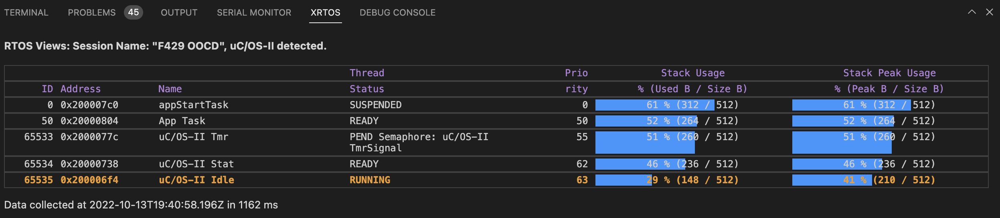
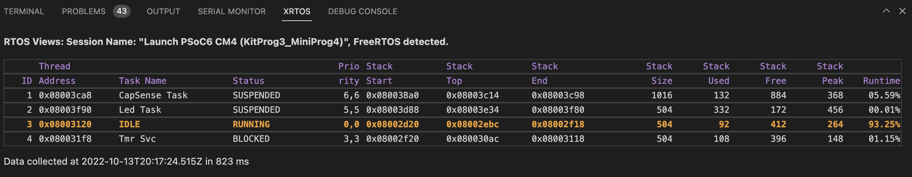
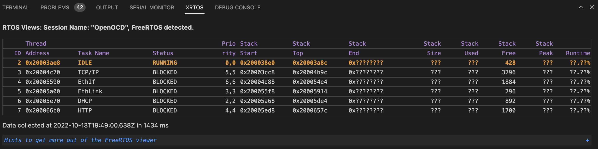
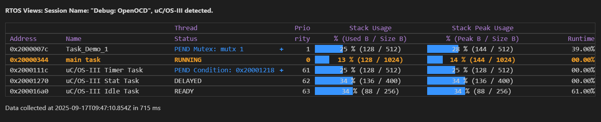

# RTOS Views

RTOS views for micro-controllers that work with any debugger. This was initially part of Cortex-Debug and has been re-factored into its own extension and is now debugger agnostic

Currently, cortex-debug, cppdbg and cspy are supported but others can easily be added upon request. The debugger has to support the [Debug Adapter Protocol](https://microsoft.github.io/debug-adapter-protocol/). This protocol specifies how to format/make requests and responses.

Most of the supported RTOSes have been contributed by users and if yours is not supported or you want to added features to be added to existing ones, please feel free to contribute. Here is the guide for getting started TODO: add link to the guide.md

Each RTOS has its own personality and its own set of global variables. We look for the existence of certain global variables to decide if there is an RTOS. Sometimes there may be optional features that are not in use and that is okay. Some of the format may also be a bit different between RTOSes but we hope to keep the same look and feel. The detection mechanism starts the first time the program is in `Stopped` state. If an RTOS is detected, we start tracking it each time the program is in `Stopped` state. Most debuggers use GDB as the backend and as such they will not allow probing while program is running. This is also an expensive operation that takes about a second.

We also have support for multiple cores/boards where each core could be running an RTOS (same or different)

If in the future, if a debugger allows non-intrusive background queries, then we might consider updating views while program is running.

The following is an example of uC/OS-II RTOS View

Here is an example of a FreeRTOS view

Here is an example of a FreeRTOS view with some information missing. We generally try to provide help to tell you what is missing and how you can change that.

Here is an example of a uC/OS-III RTOS view

NOTE: The tab name is in the screenshots is called `XRTOS` so it does not conflict with Cortex-Debug. Once the migration is complete, it will be called `RTOS` and Cortex-Debug itself will not have this functionality

# Contributors and maintainers

| RTOS           | Contributor            |
| -------------- | ---------------------- |
| FreeRTOS       | @haneefdm              |
| uC/OS-II       | @PhilippHaefele @mayjs |
| embOS          | @PhilippHaefele        |
| Zephyr (beta)  | @PhilippHaefele        |
| ChibiOS (beta) | @vrepetenko VR         |
| uC/OS-III      | @github0null           |
| ThreadX        | @raphaelmeyer          |
